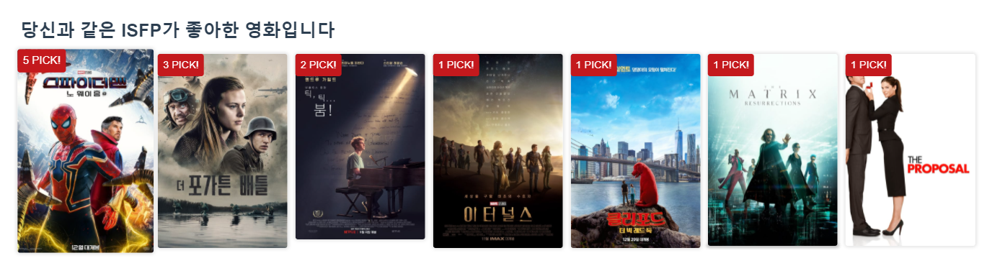

# Project final

2021.11.13 ~ 2021.11.25 총 8일간 진행된 1학기 마지막 팀 프로젝트 입니다.

팀장 : `김정빈`

팀원:  `한채은`

개발 기간: 2021.11.13 ~ 2021.11.25 총 8일

 

## 🏁 Getting started!

* 영화 정보 기반 추천 서비스 구성
* 커뮤니티 서비스 구성
* HTML, CSS, JavaScript, Vue.js, Django, REST API, DataBase 등을 활용한 실제 서비스 설계
* 서비스 관리 및 유지보수

 

## 📦 Specs, package

* TMDB API
* Vue.js
* Vuex
* Vue CLI
* Vue Router
* Axios
* Lodash
* Swiper
* Sweetalert
* Netlify

 

## 🎯 Goals

* Swipe carousel 적용
* 유저의 MBTI에 따른 영화를 추천받을 수 있음
* Infinite Scroll 구현
* Review, Comment CRUD 구현
* 트레일러 모달 구현
* 접속한 유저가 admin 일 때 버튼으로 DB 데이터를 저장하는 로직 구현
* 로그인, 로그아웃 시 검증 및 오류메세지 구현

 

## 🔗 Wire frame

 

## 👀 Recommendation Algorithm

* 내 MBTI를 기반으로 한 영화 추천 알고리즘

1. 나의 MBTI랑 같은 MBTI를 가진 유저가 영화를 `내 리스트`에 추가하면 리스트에 많이 담긴 순서대로 영화를 추천

2. 만약 '스파이더맨'을 `ISFP` 유저들이 많이 리스트에 담은 경우, 다른 ISFP 유저에게 추천해줌(가중치를 둠)

   

3. `PICK!` 을 이용해 몇 명이 리스트에 담았는지 확인 가능

## 🎁 Results

##### 1. Main

##### 

- Main 상단에는 최근에 개봉한 영화 순으로 영화에 대한 소개와 포스터 그리고 트레일러를 적용하여 사용자가 최근에 개봉한 영화를 한눈에 확인할 수 있게 구성함
- Main 중간부분에는 `유저의 MBTI`별 추천 영화를 띄어주고, 바로 아래에 최근개봉작을 띄움
- Main 하단 부분에는 최신 리뷰 리스트를 넣어 최근에 작성한 리뷰가 보이게 하였고, 클릭하여 들어가면 해당 영화의 detail 페이지로 이동함

###### 1.1 navigation bar

- 회원일경우 `Home` `Movies` `Logout` 가 뜨고, 비회원일 경우 `Logout`대신에 `signup`및 `Login`이 뜸
- `cursor`를 `pointer`로 처리하여 사용자가 확인하기 쉽게 설정하였고 `nav bar`에서 `cursor`를 떼면 숨겨지는 형식으로 완성함
- 스크롤하여 내려갈 때 `nav bar`의 `background`가 숨겨지면서` nav bar`로 인해 답답할 수 있는 화면을 와이드하게 구현하여 개방감을 줌

###### 1.2 회원 추천 알고리즘 포스터

- 회원가입할 때 입력한 MBTI를 기반으로 나랑 같은 MBTI를 가진 유저가 `my list`에 담은 영화를 추천
- 관련 내용은  `Recommendation Algorithm` 에서 설명
- 포스터 좌측상단에 `pick!` 표시를 해 몇명이 이 영화를 리스트에 담았는지 확인이 가능함

###### 1.3 비회원 추천 알고리즘 포스터

- 비회원의 경우 MBTI 정보를 가져올 수 없어 최근에 개봉한 영화 순서대로 영화추천

###### 1.4 검색 기능

.gif)

- 우측상단에서 검색가능, `input`값을 그대로 가져와서 검색결과에 보여줌
- `input 검색결과` 식으로 화면에 출력하여 사용자가 어떤 키워드를 검색했는지 확인 가능 

###### 1.5 최신 리뷰

##### 2. Movie 

###### 2.1 영화 디테일 (영화정보, 평점)

###### 2.2 MBTI pick 알고리즘

###### 2.3 나의 영화리스트에 추가

###### 2.4 장르

###### 2.5 배우 정보

##### 3. Review & Comment

###### 3.1 리뷰 작성 & 조회

###### 3.2 리뷰 수정 & 삭제

###### 3.3 코멘트 조회 & 작성 & 삭제

##### 4. Profile

###### 4.1 배경 변경

###### 4.2 회원 기본 정보

###### 4.3 영화 관련 회원 정보

##### 5. Search

###### 5.1 검색창

###### 5.2 검색결과

##### 6. Sign up & Login & Logout

##### 7. admin

###### 7.1 admin으로 DB 관리

###### 7.2 admin으로 user, movie, genre, review, comment관리

 

## 🤔 Issues..

 