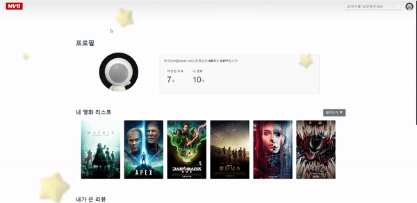
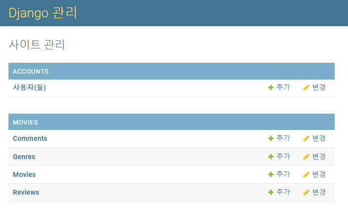

# Project final

2021.11.13 ~ 2021.11.25 총 8일간 진행된 1학기 마지막 팀 프로젝트 입니다.

- 팀장 : `김정빈`  👑

`front` :60% 

`back`: 60%

- 팀원:  `한채은` 

`front` : 40% 

`back` : 40%

개발 기간: 2021.11.13 ~ 2021.11.25 총 8일

<br>

## ⚙ essential

1. 목표 서비스 구현 및 실제 구현 정도

   실제 구현 정도: 목표의 95% 이상

   구현하고 싶지만 못했던 것: 다크 모드,  장르 별 영화를 보여주는 GNB 메뉴

2. 데이터 베이스 모델링


## 🏁 Getting started!

* 영화 정보 기반 추천 서비스 구성
* 커뮤니티 서비스 구성
* HTML, CSS, JavaScript, Vue.js, Django, REST API, DataBase 등을 활용한 실제 서비스 설계
* 서비스 관리 및 유지보수

<br>

## 📦 Specs, package

* TMDB API
* Vue.js
* Vuex
* Vue CLI
* Vue Router
* Axios
* Lodash
* Swiper
* Sweetalert
* Netlify

<br>

## 🎯 Goals

* Swipe carousel 적용
* 유저의 MBTI에 따른 영화를 추천받을 수 있음
* Infinite Scroll 구현
* Review, Comment CRUD 구현
* 트레일러 모달 구현
* 접속한 유저가 admin 일 때 버튼으로 DB 데이터를 저장하는 로직 구현
* 로그인, 로그아웃 시 검증 및 오류메세지 구현

<br>

## 🔗 Wire frame


## 👀 Recommendation Algorithm

* MBTI별 영화 추천 알고리즘

1. 나의 MBTI랑 같은 MBTI를 가진 유저가 영화를 `내 리스트`에 추가하면 리스트에 많이 담긴 순서대로 영화를 추천

2. 만약 '스파이더맨'을 `ISFP` 유저들이 많이 리스트에 담은 경우, 다른 ISFP 유저에게 추천해줌(가중치를 둠)

   

3. `PICK!` 을 이용해 몇 명이 리스트에 담았는지 확인 가능

🧩 **알고리즘 로직**

lodash filter를 이용해 user.mbti 속성이 지금 현재 접속한 user.mbti속성과 같은걸 걸러내고,  이를 이용해서 포스터를 기준으로 몇개가 있는지 count로 세어줌

이후 몇개가 있는지에 따라 정렬하기 위해서 toPairs, sortby, fromPair를 사용

```javascript
getAllMyLists: function () {
      axios({
        method: 'get',
        url: `http://127.0.0.1:8000/movies/mylists/`,
        headers: this.setToken(),
      })
      .then(res => {
        this.results = []
        let movies = res.data
        this.movies = res.data
        this.results = _.filter(movies, {'user_mbti' : this.MBTI})
      })
      .then(() => {
        let poster_path = _.countBy (this.results, "poster_path")
        this.recommends = _.fromPairs(_.sortBy(_.toPairs(poster_path), 1).reverse())
        this.isResponse = true
      })
    },
```


## 🎁 Results

##### 1. Main

##### 

- Main 상단에는 최근에 개봉한 영화 순으로 영화에 대한 소개와 포스터 그리고 트레일러를 적용하여 사용자가 최근에 개봉한 영화를 한눈에 확인할 수 있게 구성함
- Main 중간부분에는 `유저의 MBTI`별 추천 영화를 띄어주고, 바로 아래에 최근개봉작을 띄움
- Main 하단 부분에는 최신 리뷰 리스트를 넣어 최근에 작성한 리뷰가 보이게 하였고, 클릭하여 들어가면 해당 영화의 detail 페이지로 이동함

###### 1.1 navigation bar


- 회원일경우 `Home` `Movies` `Logout` 가 뜨고, 비회원일 경우 `Logout`대신에 `signup`및 `Login`이 뜸
- `cursor`를 `pointer`로 처리하여 사용자가 확인하기 쉽게 설정하였고 `nav bar`에서 `cursor`를 떼면 숨겨지는 형식으로 완성함
- 스크롤하여 내려갈 때 `nav bar`의 `background`가 숨겨지면서` nav bar`로 인해 답답할 수 있는 화면을 와이드하게 구현하여 개방감을 줌

###### 1.2 회원 추천 알고리즘 포스터


- 회원가입할 때 입력한 MBTI를 기반으로 나랑 같은 MBTI를 가진 유저가 `my list`에 담은 영화를 추천
- 관련 내용은  `Recommendation Algorithm` 에서 설명
- 포스터 좌측상단에 `pick!` 표시를 해 몇명이 이 영화를 리스트에 담았는지 확인이 가능함

###### 1.3 비회원 추천 알고리즘 포스터


- 비회원의 경우 MBTI 정보를 가져올 수 없어 최근에 개봉한 영화 순서대로 영화추천

###### 1.4 최신 리뷰


- Main 최하단에 있는 최신리뷰
- 가장 최근에 쓴 글을 별점, 제목, 사용자닉네임 순으로 보여줌
- 클릭하면 영화 상세페이지에 있는 리뷰 칸으로 넘어가게됨

##### 2. Movie 


- `nav bar`에서 `movies`를 클릭하면 db에 저장되어있는 모든 영화 최신개봉 순으로 정렬
- `infinitescroll`를 활용하여 db에 저장되어있는 모든 영화 불러오기 가능
- 트레일러가 있는 영화의 경우 영화 정보를 트레일러와 함께 상세페이지에서 볼 수 있음
- 트레일러가 없는 영화의 경우 영화 정보만 띄어줌
- 영화 포스터 옆에 `사용자 MBTI pick!` 이라는 로고를 띄어줘서 해당 영화의 리뷰를 가장 많이 단 유저의 MBTI를 보여줌 
- 바로 아래 리뷰를 달 수 있게해서 사용자가 영화에 대한 리뷰를 작성할 수 있고, 바로 댓글을 달 수 있음

###### 2.1 영화 디테일 (영화정보, 평점)

###### 

- TMDB에서 제공해주는 영화 제목, 원제, 줄거리, 장르를 상세페이지에 삽입
- 트레일러가 있는 영상의 경우 트레일러를 같이 보여줌으로써 사용자 편의 향상
- ⭐ 별점은 TMDB에 있는 별점을 기반으로 사용자에게 보여줌

###### 2.2 MBTI pick 알고리즘


- `사용자 MBTI pick!`을 활용해 어떤 MBTI를 가진 사용자가 이 영화에 리뷰를 가장 많이 달았는지 알려줌
- 사용자는 `MBTI pick!`을 기반으로 영화정보를 이용할 수 있음
- 아무도 리뷰를 달지 않은 경우 `No pick!`으로 띄어줌

###### 2.3 나의 영화리스트에 추가


- `add My List` 버튼을 활용하여 `My page`에 있는 내 영화 리스트에 담을 수 있음
- 이 정보를 기반으로 `MBTI별 영화 추천 기능` 구현

###### 2.4 장르


- 영화별로 해당 영화의 장르를 뽑아서 보여줌

###### 2.5 배우 정보


- TMDB에서 주요출연진 5명을 뽑아 어떤 배우가 출연하는지 보여줌

##### 3. Review & Comment


- 영화 상세페이지 제일 하단에 리뷰를 쓸 수 있는 폼을 위치시켜 사용자가 바로 그 영화에 리뷰를 달 수 있게 유도함
- 다른 사용자와 상호작용이 가능하게 만들음으로써 하나의 커뮤니티를 구현하려고 노력함

###### 3.1 리뷰 작성 & 조회


- 영화 상세페이지 하단에서 다른 사용자의 리뷰를 조회할 수 있고, 사용자가 리뷰 작성을 직접 할 수도 있음
- 별점을 통해 영화의 리뷰를 시각적으로 보여주어 사용자의 이해도를 높임

###### 3.2 리뷰 수정 & 삭제


- 내가 쓴 글을 수정하거나 삭제할 수 있으며, 다른 유저의 글을 수정하거나 삭제하려고 하면 에러메세지가 나옴

###### 3.3 코멘트 조회 & 작성 & 삭제

- 리뷰와 마찬가지로 코멘트도 조회가 가능하고 작성 및 삭제 가능

##### 4. Profile



- 기본적으로 제공되는 프로필에 개인 정보가 띄어짐
- 사용자의 MBTI와 닉네임, 이메일이 기본적으로 제공되며 작성한 리뷰 수와 내가 담은 영화 리스트의 개수를 보여줌
- 또한 내가 쓴 리뷰를 보여줌으로써 어떤 영화에 어떤 리뷰를 썼는지 가시적으로 확인이 가능함

###### 4.1 배경 변경


- 기본으로 제공되는 프로필에서 사용자가 새로고침 혹은 다른 페이지를 갔다가 오면 배경이 바뀜
- 배경을 바꿔줌으로써 재밌는 페이지를 구현하려고함 (약 10개의 색깔 랜덤으로 변경 가능)

###### 4.2 회원 기본 정보

- 처음 회원가입할 때 가입한 정보를 보여줌
- MBTI기반 추천 영화페이지이므로 MBTI를 프로필 페이지에서 보여줌

###### 4.3 영화 관련 회원 정보

- `add my list`를 통해 담은 영화리스트를 확인할 수 있으며 너무 많은 영화를 담을경우 사용자가 프로필 페이지에 들어갔을 때 불편함을 느낄 수 있기 때문에 기본적으로 6개만 보여줌
- 토글을 사용하여 6개 이후에 담긴 영화를 보여줌
- 내 영화 리스트에 담긴 영화를 클릭하면 영화 상세 페이지로 이동함
- 자신이 작성한 리뷰를 한번에 확인할 수 있으며 클릭하면 내가 쓴 리뷰로 이동할 수 있음

##### 5. Search


###### 5.1 검색창

- 우측상단에서 검색가능, `input`값을 그대로 가져와서 검색결과에 보여줌
- `input 검색결과` 식으로 화면에 출력하여 사용자가 어떤 키워드를 검색했는지 확인 가능 

###### 5.2 검색결과


- 관련 영화를 순서대로 띄어줌 (키워드 관련)

##### 6. Sign up & Login & Logout

##### 

- 회원가입할 때 
  1. 입력 안한 곳이 있거나
  2. 이메일 형식이 올바르지 않거나
  3. 비밀번호가 올바르게 입력되지 않았거나
  4. 정확한 MBTI를 입력하지 않은 경우 에러창을 띄어줌
- 로그인 할 때
  - 이메일이나 비밀번호가 맞지 않으면 에러창을 띄어줌
- 로그아웃 할 때
  - 로그인이 되어있는 상태에서만 로그아웃창을 보여주며 로그아웃을 누르면 바로 로그아웃 가능

##### 7. admin

###### 7.1 admin으로 영화 및 장르 DB 관리


- admin의 경우 장르 DB, 영화 DB를 관리할 수 있는 이모지를 넣어놓음 (버튼기능!)
- 장르 DB, 영화 DB를 누르면 실시간으로 DB연동되어 가져오기 기능

###### 7.2 admin으로 user, movie, genre, review, comments관리



- Django admin으로 user, movie, genre, review, comments 관리 가능(삭제, 수정, 등록 등등)

<br>

## 🤔 Issues..


👤노션을 활용해서 어떤걸 해야할지 이슈를 최대한 정리해가면서 프로젝트 구축


## 🤗느낀점

`김정빈`

처음에는 vue를 제대로 이해하지 못 한 상태에서 시작했기 때문에 실수가 잦았다. 이게 왜 이렇게 되는지도 모르고 무작정 코드를 작성하기만 했는데, 이 때문에 후반으로 갈 수록 큰 스노우 볼을 때려맞게 된다. 재 활용성을 고려하지 못한 채 코드를 짰기 때문이다

그래도 많이 고생한 만큼 결과물이 잘 나와주어서 고맙고, 시간에 쫒겨서 또는 기술적 어려움, 갈아엎어야 함 등등의 이유로 제대로 구현하지 못한 기능들이 있는 게 아쉽긴 하다. 사소한 기능이 UX적으로 사용자에게 어떤 경험을 안겨 주는지 직접 개발하고 체험하면서 느껴 볼 수 있었기 때문이다.

또, 우리는 파트를 나누지 않고 UI 구상부터 기능과 구현까지  함께 했는데 서로 같은 부분을 작업 하기에 이야기 하면서 할 수 있었어서 재미도 있고, 서로 막힘이 있을 때마다 도와 줄 수 있어서 좋았던 것 같다! 아이디어 적인 측면에서도 이렇게 저렇게 많은 방법 제시를 해주고 도움을 준 페어 덕분에 힘들지만 즐겁게 개발했다!!!

🧱 개발 하면서 괴로웠던 것 : 오타로 몇 시간을 날린 것, 초반의 잘못된 선택(모델링 등)으로 후반에 갈수록 오류를 뿜었던 것...


`한채은`

처음에 JS에서부터 아슬아슬했던 나라 Vue는 이해도가 더 낮았던 것 같다. 그래서 그런지 Vue는 보면 볼수록 새로웠고 Vue Cli로 해도 어려웠고 Vuex를 쓰려니까 더 어려웠던 그냥 어려움의 끝이였다..

하지만 페어가 정말 잘해줬다. 잘 모르는 상황임에도 불구하고 먼저 다 나서서 해줘서 나는 부랴부랴 페어 따라가면서 많이 배웠다.. ㅠㅠ 그래서 너무 미안했고 고마웠다. 초반에 오타 실수부터 이벤트나 여러 문법들이 너무 많아 헷갈려서 힘들었고 또 문법을 제대로 사용하지 않아 로직은 정확한데 자꾸 페이지가 오류가 나는 상황들을 겪었다. 다행이 다른 분의 도움을 받아 전체적인 흐름에 대해 다시 한번 설명을 듣고 제대로 코딩을 하려고 노력했다. 문법도 생소하고 배운 기간도 짧아 명세에 나온 흐름만 제대로 가져가면 성공이라고 생각했는데 대체로 하고 싶은 기능구현은 다 해서 뿌듯하기도하고 좋기도하다.

페어랑 하루에 4시간, 5시간씩 자면서 졸린눈으로 매일 코딩했는데 그래도 멘탈 흔들릴때마다 서로 격려도 해주고 도 이야기도 하면서 앞으로 잘 나아갔던거 같다.  정말 페어의 힘이 컸던게 완성할 수 없을거라고 생각했던 프로젝트를 완벽하게 완성해서 너무 좋다.

페어에게 배울점이 너무 많았다. 코딩을 하면서 시간에 비례해서 결과물이 안나오는게 참 아쉬웠지만 더 노력해서 배워야겠다고 생각했다.

🧱 개발 하면서 괴로웠던 것: 정말 작은 오류도 보고 넘어가야한다.. 스노우볼이 너무 크게온다.. 그리고 내가 너무 무지해서 힘들었다. 다음엔 더 열심히 공부해서 누군가를 이끌 수 있는 사람이 되고싶다.


## 🎸기타사항

- 최대한 오류메세지를 띄어 사용자가 잘못된 경로로 접근하는걸 막으려고 노력함
- 작성시간 및 수정시간을 띄어주어 언제 쓴 글인지, 언제 수정한 글인지 사용자에게 알려줌
- keyup.enter를 글을 작성할때나 회원가입, 로그인 등에 사용함
-  사용자가 키보드를 사용하다가  마우스로 다시 가지 않는 점을 파악하여 세부적인 사용자 편의에 집중함


- db를 실시간으로 가져오기 성공!

